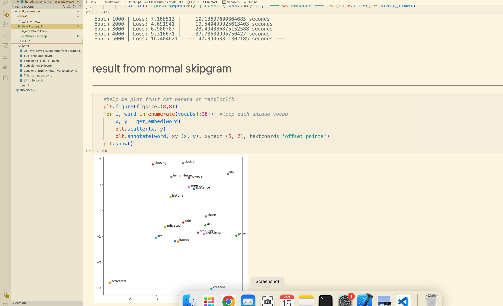
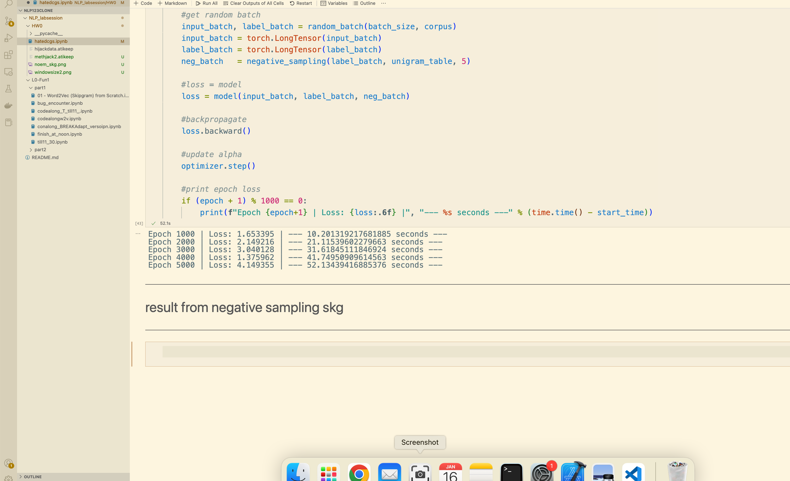

## This folder contain the assignment that i work on
- which including.
	- the notebook file
	- the `atikeep` file that I use for store corpus that I retrive
	- img file that I use for represent the result

- To check that I done the homework on time, please check pdf file
	- the question number -1  is here incase you check via pdf
## result of normal skipgram

## result of neg sampling skipgram

