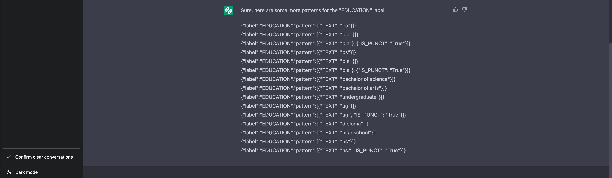
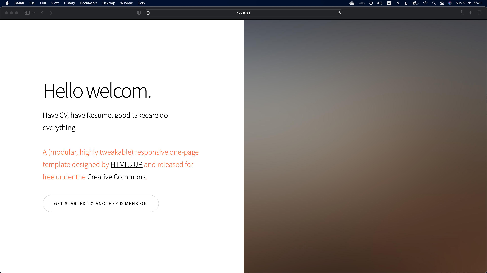
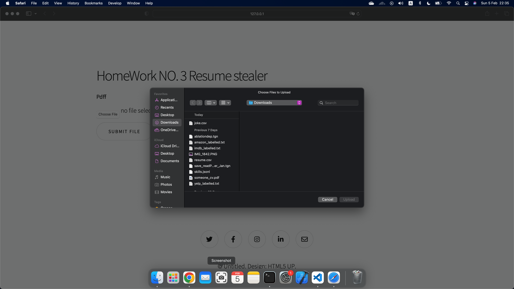

## To use

### You need to find different template.
- ####  Atleast visit `HTML5UP` website

#### you can find tutorial on how to run flask app on `flask Doc`.

#### this directory is use `weirgzung` and `wtform` to perform upload, thus you might need to read the doc if u want to use.

#### I use chatGPT to generate a jsonl pipeline for education title extracting and partial copied from Tonson



----------------

## If you dont want to use a doc

- First, `pip install -r requirement.txt`
- then on bash -> $ `export FLASK_APP = main`
- then $`flask run`
### But u still need to download your own template
-------------------
## If you do not want to run my code here I will show you how it work
- ### Homepage
 

- ### UploadPage


- ### File uploading


- ### Result


---------------

## code Struceture for my flask web app
```bash
.
├── __pycache__
│   ├── data_stealer.cpython-39.pyc
│   ├── form_.cpython-39.pyc
│   └── main.cpython-39.pyc
├── data_stealer.py
├── form_.py
├── instance
├── main.py
├── static
│   ├── assets
│   │   ├── css
│   │   │   ├── fontawesome-all.min.css
│   │   │   ├── main.css
│   │   │   └── noscript.css
│   │   ├── js
│   │   │   ├── breakpoints.min.js
│   │   │   ├── browser.min.js
│   │   │   ├── demo.js
│   │   │   ├── jquery.min.js
│   │   │   ├── jquery.scrollex.min.js
│   │   │   ├── jquery.scrolly.min.js
│   │   │   ├── main.js
│   │   │   └── util.js
│   │   ├── sass
│   │   │   ├── base
│   │   │   │   ├── _page.scss
│   │   │   │   ├── _reset.scss
│   │   │   │   └── _typography.scss
│   │   │   ├── components
│   │   │   │   ├── _actions.scss
│   │   │   │   ├── _banner.scss
│   │   │   │   ├── _box.scss
│   │   │   │   ├── _button.scss
│   │   │   │   ├── _form.scss
│   │   │   │   ├── _gallery.scss
│   │   │   │   ├── _icon.scss
│   │   │   │   ├── _icons.scss
│   │   │   │   ├── _image.scss
│   │   │   │   ├── _index.scss
│   │   │   │   ├── _items.scss
│   │   │   │   ├── _list.scss
│   │   │   │   ├── _row.scss
│   │   │   │   ├── _section.scss
│   │   │   │   ├── _spotlight.scss
│   │   │   │   ├── _table.scss
│   │   │   │   └── _wrapper.scss
│   │   │   ├── layout
│   │   │   │   └── _wrapper.scss
│   │   │   ├── libs
│   │   │   │   ├── _breakpoints.scss
│   │   │   │   ├── _functions.scss
│   │   │   │   ├── _html-grid.scss
│   │   │   │   ├── _mixins.scss
│   │   │   │   ├── _vars.scss
│   │   │   │   └── _vendor.scss
│   │   │   ├── main.scss
│   │   │   └── noscript.scss
│   │   └── webfonts
│   │       ├── fa-brands-400.eot
│   │       ├── fa-brands-400.svg
│   │       ├── fa-brands-400.ttf
│   │       ├── fa-brands-400.woff
│   │       ├── fa-brands-400.woff2
│   │       ├── fa-regular-400.eot
│   │       ├── fa-regular-400.svg
│   │       ├── fa-regular-400.ttf
│   │       ├── fa-regular-400.woff
│   │       ├── fa-regular-400.woff2
│   │       ├── fa-solid-900.eot
│   │       ├── fa-solid-900.svg
│   │       ├── fa-solid-900.ttf
│   │       ├── fa-solid-900.woff
│   │       └── fa-solid-900.woff2
│   ├── edu_skill.jsonl
│   ├── files
│   │   └── joke.csv
│   ├── images
│   │   ├── banner.jpg
│   │   ├── franc.webp
│   │   ├── francis.png
│   │   ├── francis2.png
│   │   ├── gallery
│   │   ├── pic01.jpg
│   │   ├── pic02.jpg
│   │   ├── pic03.jpg
│   │   ├── sca.png
│   │   ├── spotlight01.jpg
│   │   ├── spotlight02.jpg
│   │   └── spotlight03.jpg
│   └── skills.jsonl
└── templates
    ├── footer.html
    ├── header.html
    ├── index.html
    ├── index_.html
    ├── stealed.html
    └── upload.html
```