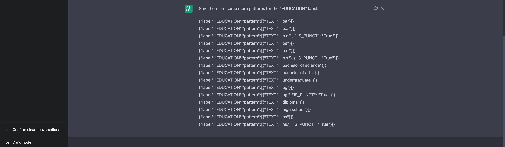

## To use

### You need to find different template since It quite illigal to direct use from me.
- ####  Atleast visit `HTML5UP` website

#### you can find tutorial on how to run flask app on `flask Doc`.

#### this directory is use `weirgzung` and `wtform` to perform upload, thus you might need to read the doc if u want to use.

#### I use chatGPT to generate a jsonl pipeline for education title extracting and partial copied from Tonson

----------------

## If you dont want to use a doc

then `pip install -r requirement.txt`
then on bash -> $ `export FLASK_APP = main`
then $`flask run`
### But u still need to download your own template